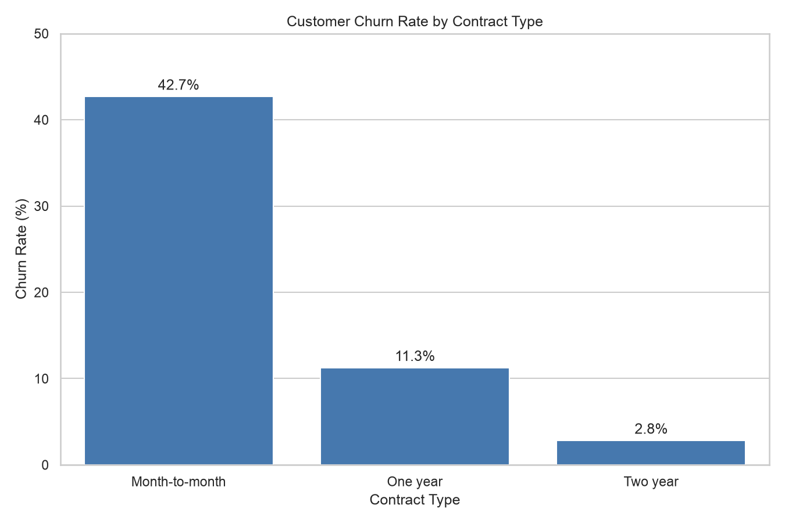
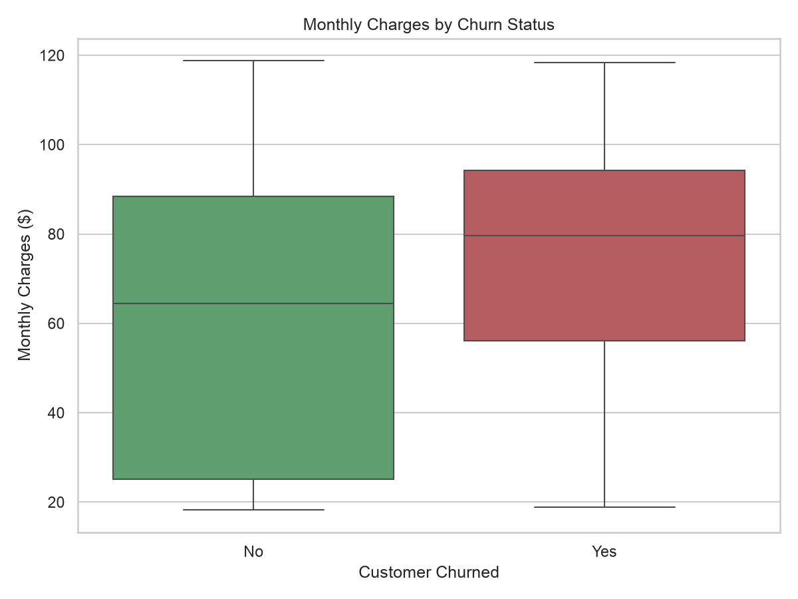
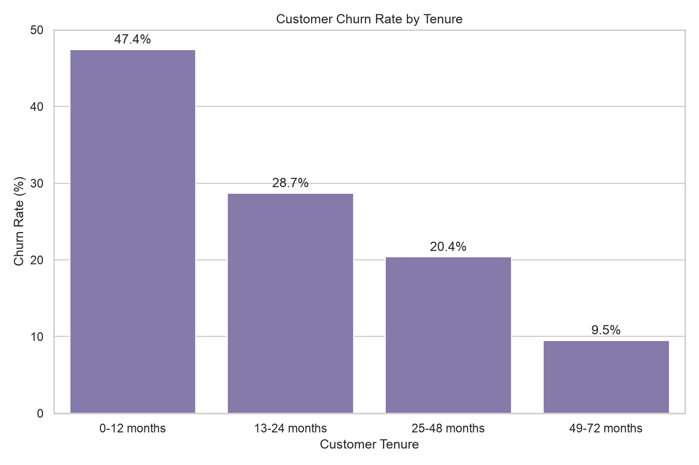
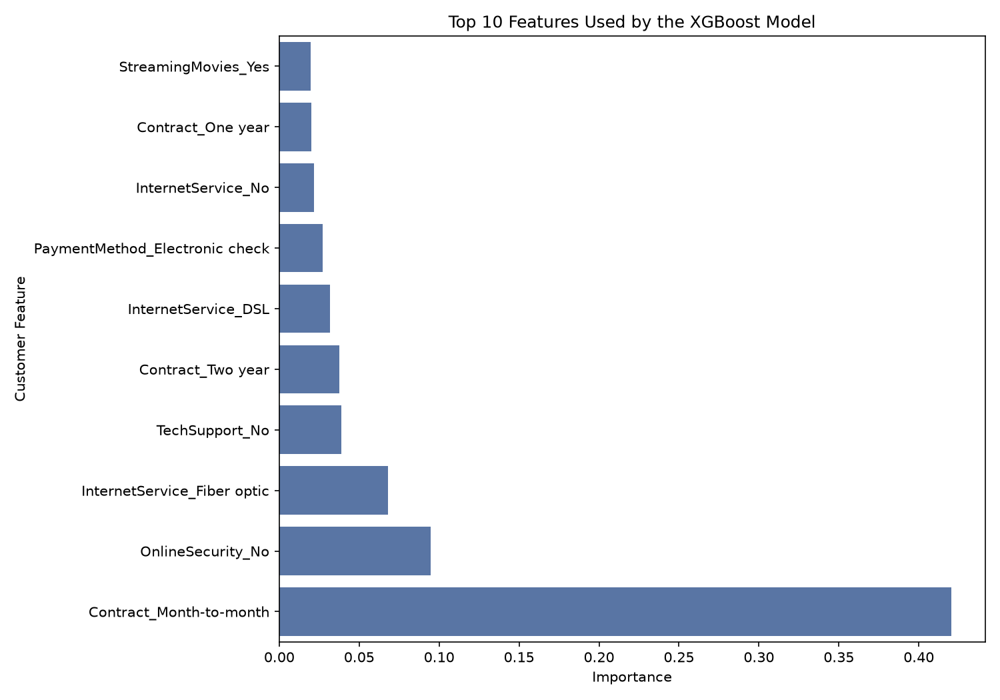

# Customer Churn Prediction

An end-to-end machine-learning project that analyzes telecom customer behavior and predicts customers who may be at risk of leaving.

## Project Overview

Customer churn occurs when customers stop using a company’s services. Identifying high-risk customers can help a company offer support or retention incentives before those customers leave.

This project covers:

- Data inspection and cleaning
- Exploratory data analysis
- Customer churn visualizations
- Logistic regression baseline modeling
- XGBoost classification
- Model evaluation
- Feature-importance analysis
- Interactive predictions using Streamlit

## Project Workflow

```text
Customer dataset
      ↓
Data inspection and cleaning
      ↓
Exploratory analysis and visualization
      ↓
Model training and evaluation
      ↓
Saved XGBoost pipeline
      ↓
Streamlit prediction application
```

## Dataset

The project uses the public IBM Telco Customer Churn dataset, containing 7,043 customers and 21 columns.

Dataset source:

https://raw.githubusercontent.com/IBM/telco-customer-churn-on-icp4d/master/data/Telco-Customer-Churn.csv

Customer information includes contract type, tenure, internet service, support services, payment method, monthly charges and churn status.

## Key Findings

- Overall customer churn rate was 26.54%.
- Month-to-month customers had a 42.7% churn rate.
- One-year customers had an 11.3% churn rate.
- Two-year customers had a 2.8% churn rate.
- Customers in their first 12 months had a 47.4% churn rate.
- Customers who churned generally had higher monthly charges.
- Contract type was the strongest feature used by the XGBoost model.

## Visualizations

### Churn Rate by Contract



### Monthly Charges by Churn Status



### Churn Rate by Tenure



### XGBoost Feature Importance



## Model Comparison

| Measurement | Baseline Logistic Regression | Balanced Logistic Regression | XGBoost |
|---|---:|---:|---:|
| Accuracy | 77.86% | 73.81% | 74.45% |
| Precision | 60.13% | 50.43% | 51.21% |
| Recall | 49.20% | 78.34% | 79.41% |
| F1 score | 54.12% | 61.36% | 62.26% |
| Missed churners | 190 | 81 | 77 |

The XGBoost model achieved an ROC-AUC score of 84.68%.

The final model prioritizes recall because missing a customer who is likely to churn may be more costly than contacting a customer who eventually stays.

## Technologies

- Python
- Pandas
- Matplotlib
- Seaborn
- Scikit-learn
- XGBoost
- Streamlit
- Git and GitHub

## Repository Structure

```text
telco-churn-project/
├── app.py
├── customer_basics.py
├── explore_data.py
├── clean_data.py
├── analyze_churn.py
├── visualize_churn.py
├── train_baseline_model.py
├── train_improved_model.py
├── train_xgboost_model.py
├── requirements.txt
├── models/
│   └── churn_xgboost_pipeline.joblib
└── reports/
    └── figures/
```

## Run the Application

Clone the repository:

```bash
git clone https://github.com/ksainithin/telco-churn-project.git
cd telco-churn-project
```

Create and activate a virtual environment:

```bash
python3 -m venv .venv
source .venv/bin/activate
```

Install the required packages:

```bash
python -m pip install -r requirements.txt
```

On macOS, XGBoost may require the OpenMP library:

```bash
brew install libomp
```

Start the application:

```bash
streamlit run app.py
```

## Reproduce the Analysis

Download the dataset:

```bash
mkdir -p data
curl -L "https://raw.githubusercontent.com/IBM/telco-customer-churn-on-icp4d/master/data/Telco-Customer-Churn.csv" -o data/telco_churn.csv
```

Clean and analyze it:

```bash
python clean_data.py
python analyze_churn.py
python visualize_churn.py
```

Train the models:

```bash
python train_baseline_model.py
python train_improved_model.py
python train_xgboost_model.py
```

## Limitations

- The dataset represents a fictional telecommunications company.
- Model performance may change on real or newer customer data.
- Feature importance does not prove that a feature causes churn.
- The displayed model score should not be treated as a guaranteed probability.
- Retention decisions should include business costs and human review.

## Future Improvements

- Tune model settings using cross-validation.
- Add prediction explanations for individual customers.
- Compare additional classification models.
- Add automated tests and data validation.
- Deploy the Streamlit application online.
- Monitor model accuracy and data changes over time.